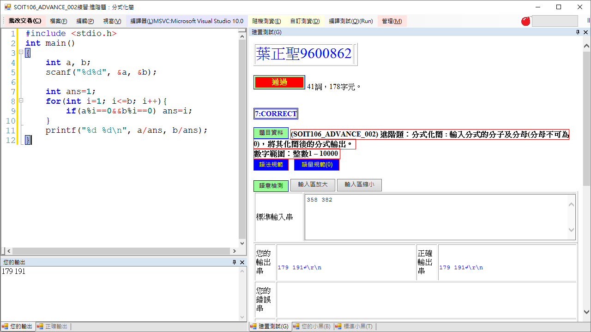
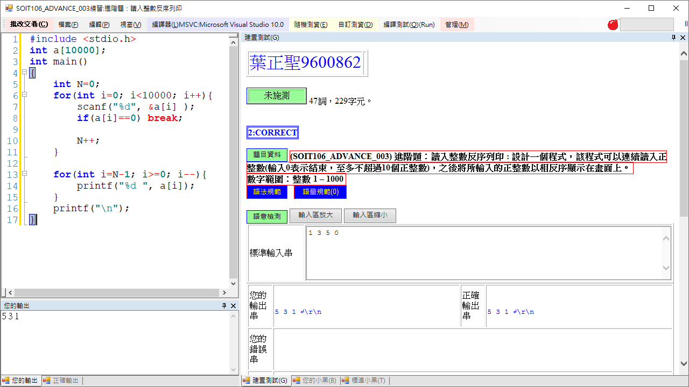

# 2020cce

# 第01週的實習課程式

## 第一題 進階題：分式化簡
```C
#include <stdio.h>
int main()
{
	int a, b;
	scanf("%d%d", &a, &b);
	
	int ans=1;
	for(int i=1; i<=b; i++){ //利用沒效率的for迴圈找最大公因數
		if(a%i==0&&b%i==0) ans=i;
	}
	printf("%d %d\n", a/ans, b/ans);
}
```
雖然 input 測試資料最大 10000 還可用「沒效率的for-loop暴力法」來找, 但有位熱心網友 @25077667 [建議直接使用 GCD](https://github.com/jsyeh/2020cce/commit/91995977b6b4301a8c841c7a2bae598d406337e4) 來計算最大公因數。
所以我也把另外2種寫法順便分享

```C
//GCD Mehtod 1: Recursion
#include <stdio.h>
int gcd(int a, int b) //recursion 使用函式呼叫函式的 GCD 版本
{
	if(a==0) return b;
	if(b==0) return a;
	return gcd(b, a%b);
}
int main()
{
	int a, b;
	scanf("%d%d", &a, &b);
	
	int c=gcd(a,b);
	printf("%d %d\n", a/c, b/c);
	return 0;
}
```

```C
//GCD Version 2: while-loop
#include <stdio.h>
int main()
{
	int a, b;
	scanf("%d%d", &a, &b);

	int a2=a, b2=b;
	//因為後面找最大公因數時會影響到 a 和 b 的值, 所以要備份

	int c=a%b;
	while( c>0 ){ //使用while迴圈進行輾轉相除法
		a=b;
		b=c;
		c=a%b;
	}
	int gcd=b; //輾轉相除法 離開while迴圈後, b的值是最大公因數

	printf("%d %d\n", a2/gcd, b2/gcd );
	return 0;
}。
```




## 第二題 進階題：讀入整數反序列印
```C
#include <stdio.h>
int a[10000];
int main()
{
	int N=0;
	for(int i=0; i<10000; i++){
		scanf("%d", &a[i] );
		if(a[i]==0) break;
		
		N++;
	}
	
	for(int i=N-1; i>=0; i--){
		printf("%d ", a[i]);
	}
	printf("\n");
}
```


